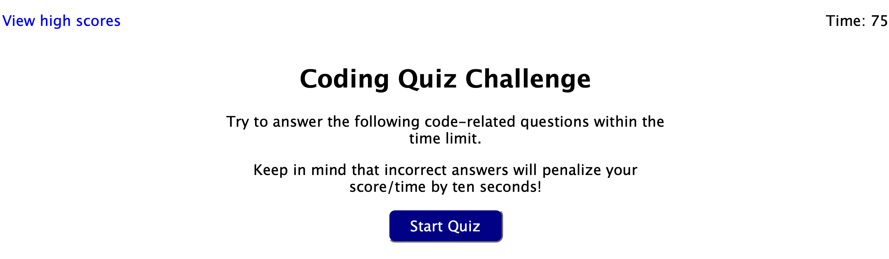
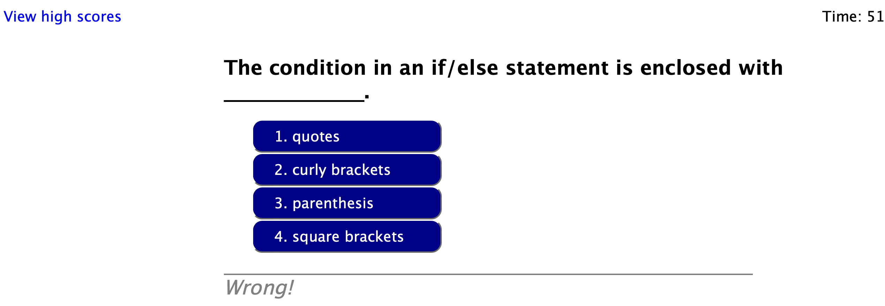
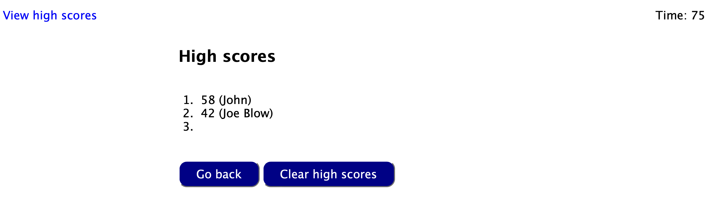

# Coding-Quiz-Challenge

Test your knowledge of JavaScript with this coding challenge!

<https://clstevenson.github.io/Coding-Quiz-Challenge/>

There are a series of (currently five) questions. This is a timed quiz, answering quickly is good: your score when you finish all the questions is the amount of time remaining on the clock. But if you answer incorrectly, 10 seconds are deducted from the timer!

The timer starts when you click the "Start Quiz" button.

The quiz is a series of questions such as the one below.

Below the questions is the result from your answer to the previous question. Once you finish, you are prompted to enter your initials, which are displayed if you are one of the top three scores.

One can view the high scores at any time by clicking the text in the upper left corner.

## Planned Future Enhancements

- randomize the questions and answers so the quizzes will not be identical
- larger testbank of questions
- user selection of the quiz length (number of questions)
- display of time/dates with the high scores
- allow user to quit during the quiz
- if user's score is zero, don't prompt them for initials
